# DataCo Supply Chain - PySpark EDA Project on Databricks Environment

## Important Links
- **Databricks Notebook**: [Access Here](https://databricks-prod-cloudfront.cloud.databricks.com/public/4027ec902e239c93eaaa8714f173bcfc/649705917837865/179433283878260/8453874180793124/latest.html)
- **Dataset**: [Kaggle - DataCo Supply Chain](https://www.kaggle.com/datasets/shashwatwork/dataco-smart-supply-chain-for-big-data-analysis)

## Project Description
DataCo Global is a multinational company specializing in supply chain management, utilizing data-driven insights to optimize provisioning, production, sales, and distribution processes. In this project, we analyze a dataset from DataCo’s supply chain operations to evaluate performance across key metrics. The analysis was conducted using PySpark in Databricks, where we performed end-to-end data processing and visualization.

This project aims to identify key performance indicators (KPIs) and address essential business questions to improve operational efficiency, enhance customer satisfaction, and optimize financial performance through business analytics techniques.

## Dataset Description
The dataset consists of multiple CSV files:
- **Primary Dataset** (`DataCoSupplyChainDataset.csv`): Contains 53 columns and 180,519 records detailing various aspects of the supply chain, including order details, customer information, shipping, and financial data.
- **Column Description File** (`DescriptionDataCoSupplyChain.csv`): Provides detailed descriptions of each column in the primary dataset.
- **Access Logs** (`tokenized_access_logs.csv`): Contains 469,977 records across 8 columns, covering user access logs with fields such as IP address, visited URLs, and timestamps. These logs span from September 2017 to February 2018.
- **Order Cities Geolocation** (`order_city_geolocation.csv`): A supplementary dataset generated using `coordinate_generator.py`, which includes the geographic coordinates of various order cities. This data was utilized to calculate the distance between seller and buyer locations, enabling further analysis on delivery efficiency and logistics.

# Business Analysis Report

## 1. Operational Efficiency

### How does shipping mode affect delivery times and customer satisfaction? Which shipping modes are most reliable?

    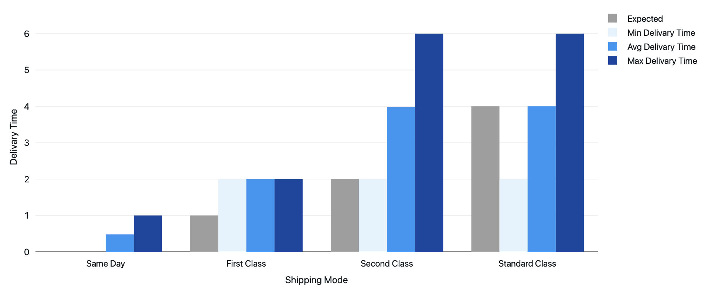
     
    <b>Figure 1.1:</b> Delivery Times by Shipping Mode
     

From **Figure 1.1**, we observe the following trends:
- **Same Day Delivery**: Although expected to deliver in 0 days, it consistently takes at least 1 day.
- **First Class Delivery**: Expected delivery in 1 day but consistently takes 2 days minimum.
- **Second Class Delivery**: Occasionally on schedule, but averages 4 days (twice the expected 2 days).
- **Standard Class**: The most reliable mode, with delivery times aligning closely to expectations.

    
     
    <b>Figure 1.2:</b> Delivery Status Distribution by Shipping Mode
     

In **Figure 1.2**:
- **Standard Time** and **Same Day Shipping**: Both deliver on time or early around 50% of the time.
- **Second Class**: Achieves on-time delivery for only 20% of orders.
- **First Class**: Records no on-time deliveries.
- Each mode experiences about 5% canceled shipments.

**Conclusion**: **First Class** shipping requires improvements in speed or reconsideration. Standard and Second Class also warrant optimizations to improve on-time rates.

---

### What is the average delay in delivery time, and how often do orders arrive late?

    
     
    <b>Figure 1.3:</b> Late Delivery Distribution
     

On average, orders are delayed by **1.62 days**, affecting **0.57%** of all shipments. **Figure 1.3** reveals that most late deliveries are delayed by only 1 day, but **40%** of delayed shipments take 2 or more days to arrive.

---

### What regions have the highest late delivery rates? What is the relationship to their distance?

    
     
    <b>Figure 1.4:</b> Order Distance Distribution by Delivery Status
     

Regions with the highest late delivery rates include **República Democrática del Congo** (62% of orders late), followed by Nicaragua, Egipto, Austria, Alemania, India, El Salvador, Filipinas, Indonesia, and Francia, each with more than 58% of orders arriving late.

In **Figure 1.4**, we see that distance has minimal impact on delivery timeliness; the distribution of distances for late versus on-time deliveries is nearly identical.

## 2. Financial Analysis:

### What is the average profit per order?
The average profit per order is **$21.97**, indicating that while some orders result in significant losses, the overall performance remains positive. The maximum profit achieved was **$911.80**, demonstrating the potential for high returns, whereas the maximum loss reached **$-4274.98**, highlighting the risk of unprofitable orders. 

The profits are concentrated, and a more granular look shows that approximately 25% of orders generate profits of **$6.75 or less**, while the median profit stands at **$30.86**, reflecting that half of the orders exceed this amount. A 75% percentile profit of **$63.16** indicates that a quarter of orders yield even higher returns.

The Order Item Profit Ratio has a mean of **0.1206**, suggesting that, on average, orders yield a profit margin of about **12%**. The standard deviation of **0.4668** implies considerable variation, with some orders experiencing losses up to **-2.75** and others yielding a maximum profit ratio of **0.50**. The 25% percentile profit ratio of **0.07** suggests that a significant portion of orders has a low profit margin, while a median profit ratio of **0.27** shows that half of the orders are more profitable.

### What is the return on discounts provided to customers?
For customers who received discounts, the return on discount (calculated as Order Profit Per Order divided by Order Item Discount) averages **2.23**, meaning for every dollar discounted, the company earns over **$2** in profit. The standard deviation of **14.13** indicates variability in return rates, with a minimum return of **-272.24** showcasing instances where discounts led to substantial losses. Conversely, the maximum return of **49.82** illustrates the potential for significant profit from discounted sales.

The approximate median return of **1.84** and the 25% and 75% percentiles of **0.46** and **4.47**, respectively, reinforce that while many discounted orders yield a good return, some yield minimal returns.

### Which product categories generate the most revenue and profit?
From the figure below, we can see that the **Fishing** category has the highest revenue and profit, generating almost **$7,000,000** in revenue. The categories with good total revenue and profit include: **Cleats**, **Camping & Hiking**, **Cardio Equipment**, **Women's Apparel**, **Water Sports**, **Men's Footwear**, and **Indoor/Outdoor Games**.

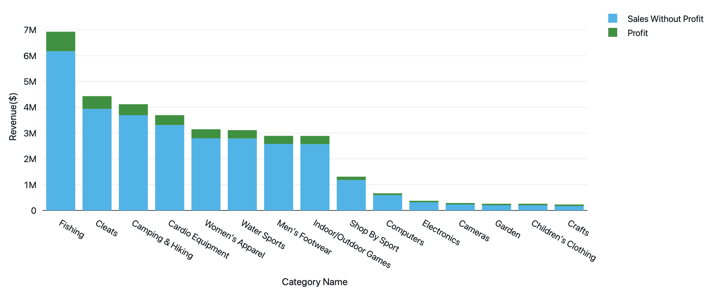
*Figure 2.1: Revenue by Category*

### How do discounts affect overall profitability?

|                          | Discounted Products      | Regular Price Products  |
|--------------------------|--------------------------|--------------------------|
| Total Profit             | $3,699,490.57            | $267,412.40              |
| Average Profit           | $21.70                   | $26.67                   |
| Average Profit Ratio     | 0.1202                   | 0.1275                   |

It seems like for regular products, the profit was greater by a huge margin than for discounted products. However, the average profit ratio is almost similar, indicating that discounted and regular products have similar profit margins.

## 3. Customer and Market Analysis

### How do customer segments differ in purchasing behavior?

*Figure 3.1: Sales by Customer Segment*

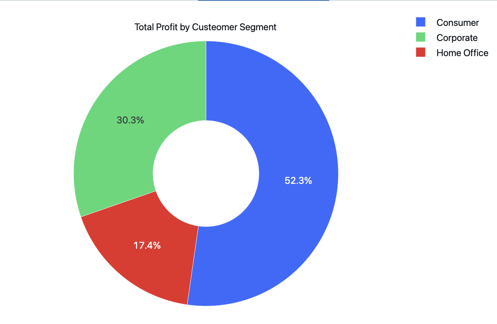
*Figure 3.2: Profit by Customer Segment*

From Figures 3.1 and 3.2, we observe that both total revenue and profit are predominantly driven by **Consumers**, who contribute to half of the sales. The remaining revenue and profit are divided between **Corporate** customers (30%) and **Home Office** customers (20%).

### Which markets perform the best in terms of sales and profit?
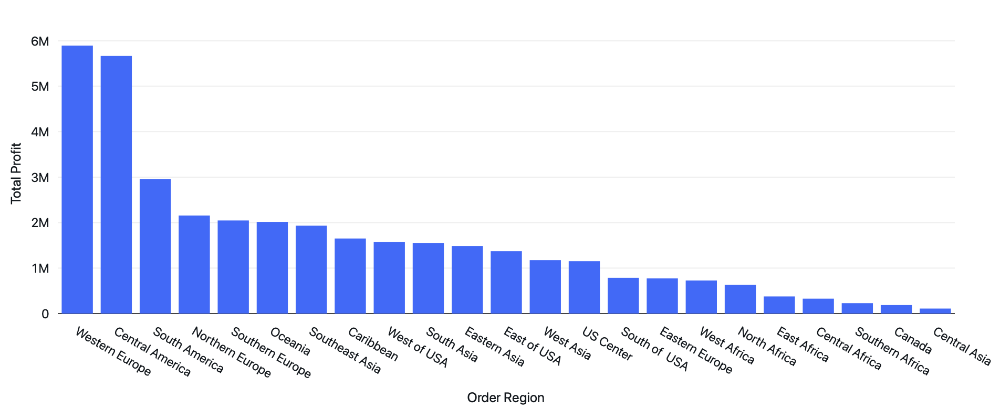
*Figure 3.3: Sales by Region*

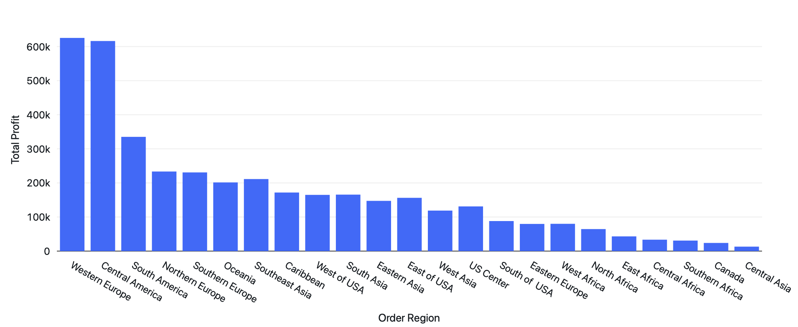
*Figure 3.4: Profit by Region*

In Figures 3.3 and 3.4, it’s clear that **Western Europe** and **Central America** are the top-performing markets, each generating approximately **$5.8 million** in revenue. **South America** follows with nearly **$3 million** in revenue, while all other regions report revenue below **$2.2 million**.

### What regions have the highest customer demand for certain product categories?
**Western Europe**, **Central America**, and **South America** show strong customer demand for **Cleats**, **Men’s Footwear**, and **Women’s Apparel**. Similar preferences are observed in other regions, though at varying levels of demand.

## 4. Fraud and Risk Analysis

### Are there patterns in suspected fraudulent orders?
We calculated the ratio of suspected fraud cases across different regions, countries, and product categories to identify patterns and areas of concern.

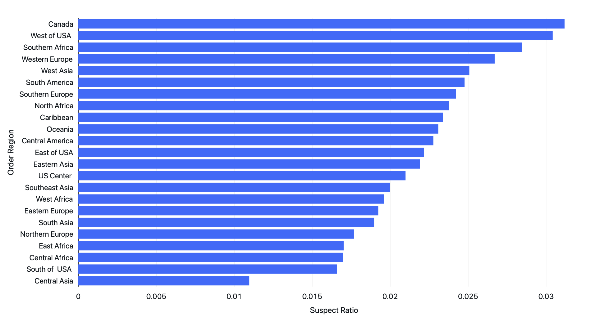
*Figure 4.1: Suspected Fraud by Region*

From Figure 4.1, fraud ratios appear highest in **Canada**, the **Western USA**, and **Southern Africa**. However, these regions don’t exhibit significantly higher fraud rates than others, suggesting that suspected fraud is somewhat evenly distributed.

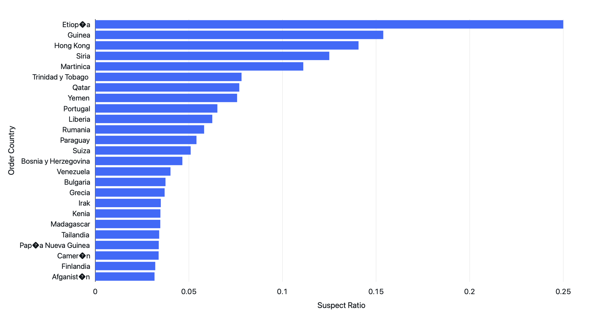
*Figure 4.2: Suspected Fraud by Country*

Figure 4.2 reveals that **Ethiopia** has a markedly high fraud ratio, with **25%** of its orders flagged as suspected. Other countries with higher fraud rates include **Guinea**, **Hong Kong**, **Syria**, and **Martinique**, each with suspected fraud ratios exceeding **10%**. Heightened fraud monitoring is recommended in these countries.

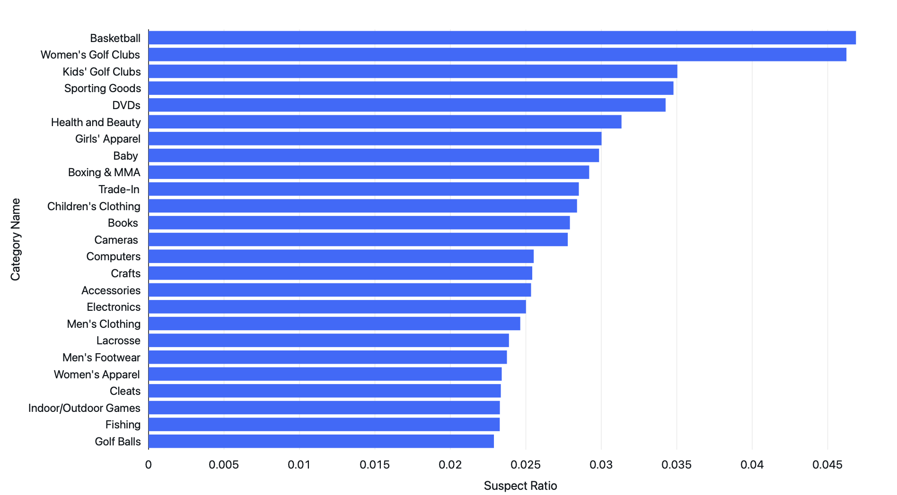
*Figure 4.3: Suspected Fraud by Category*

As shown in Figure 4.3, the **Basketball** and **Women’s Golf Club** categories experience a notably high level of suspected fraud. Orders within these categories should be carefully reviewed to prevent fraudulent transactions.

## 5. Customer Engagement Analysis:

### Which categories and products receive the most user visits?

  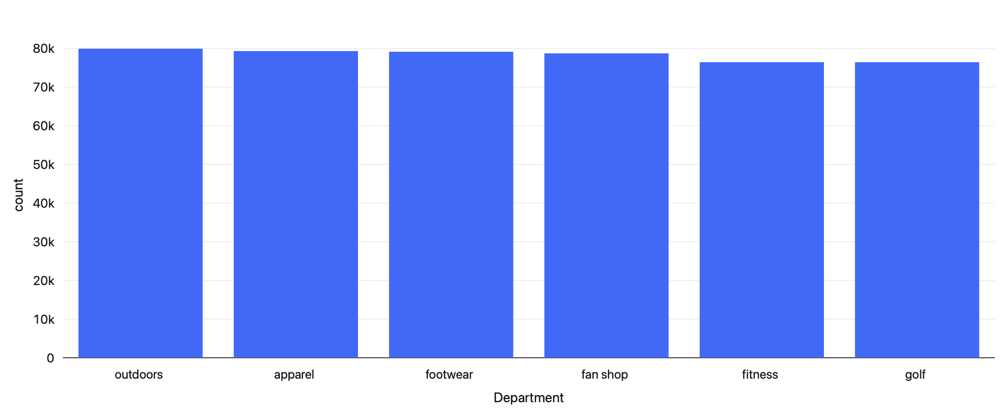

<em>Figure 5.1: Most Visited Department</em>

From Figure 5.1, we observe that all departments receive a relatively equal amount of visitor traffic, indicating consistent user interest across various departments.

  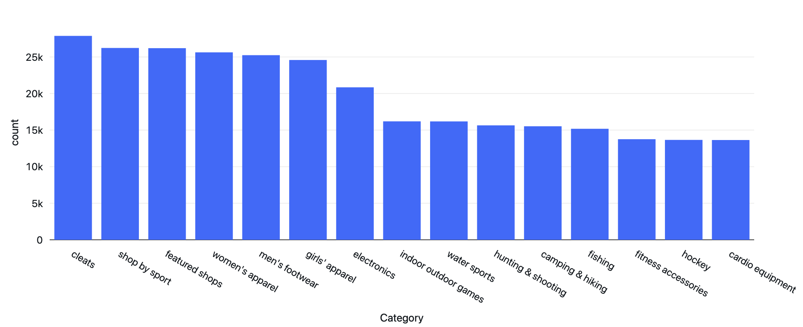

<em>Figure 5.2: Most Visited Category</em>

In Figure 5.2, we see that most categories experience similar visitor counts, although certain categories attract slightly more traffic. Notable categories with elevated visitor numbers include **Cleats**, **Shop by Sport**, **Featured Shops**, **Women’s Apparel**, **Men’s Footwear**, and **Girls’ Apparel**.

  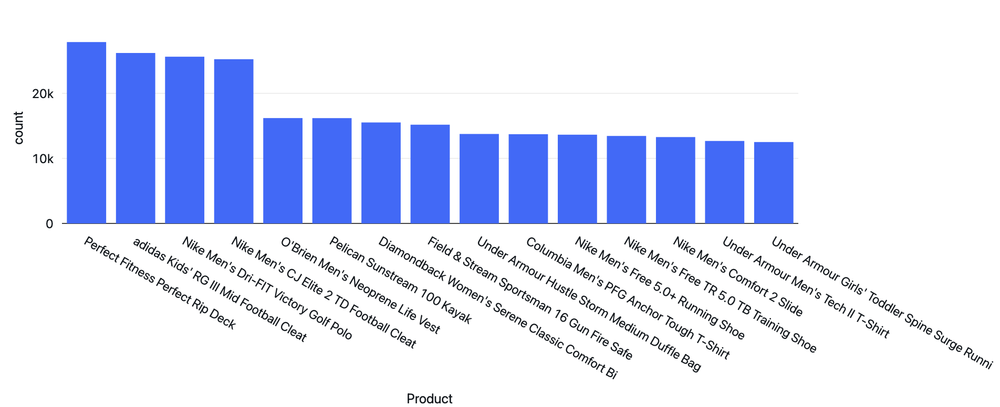

<em>Figure 5.3: Most Visited Products</em>

From Figure 5.3, we can see the most visited products are:
- **Perfect Fitness Perfect Rip Deck**
- **adidas Kids' RG III Mid Football Cleat**
- **Nike Men's Dri-FIT Victory Golf Polo**
- **Nike Men's CJ Elite 2 TD Football Cleat**

Each of these products garnered over 20,000 visits from customers.

### Which times receive the most user visits?

The data indicates a spike in visits in **September**, possibly due to a special event or promotion not specified in the dataset.

  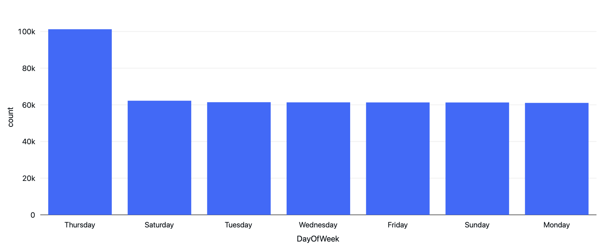

<em>Figure 5.4: Most Visited Weekday</em>

From Figure 5.4, we see that **Thursdays** experience the highest traffic, while other weekdays have roughly equal visitor numbers.

  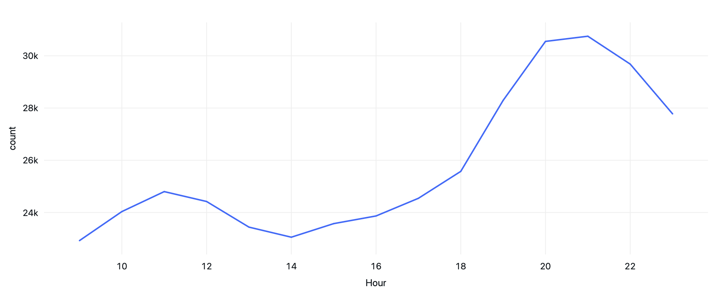

<em>Figure 5.5: Most Visited Hour</em>

In Figure 5.5, user visits generally occur between **9 AM and 11 PM**. Morning visits increase gradually, peak around **8–9 PM**, and taper off after **12 PM**, with a notable resurgence after **6 PM**.

# Summary

## 1. Operational Efficiency

### How does shipping mode affect delivery times and customer satisfaction? Which shipping modes are most reliable?
- **Same Day** and **First Class** frequently miss delivery time expectations, while **Standard Class** is most reliable.
- **Second Class** has a low on-time rate of 20%, and **First Class** records no on-time deliveries.

### What is the average delay in delivery time, and how often do orders arrive late?
- Orders experience an average delay of **1.62 days**, with **0.57%** of all shipments delayed. Most delayed shipments are only 1 day late.

### What regions have the highest late delivery rates? What is the relationship to their distance?
- **República Democrática del Congo** (62%) and several other countries have high late delivery rates, but delivery delays show minimal correlation with order distance.

## 2. Financial Analysis

### What is the average profit per order?
- Average profit per order is **$21.97**, with a wide range from losses up to **$-4274.98** to a maximum profit of **$911.80**. A 27% average profit margin is observed.

### What is the return on discounts provided to customers?
- Discounts yield **$1.84** profit per dollar, showing a favorable average return, though variability exists in the outcome of discounted sales.

### Which product categories generate the most revenue and profit?
- **Fishing** is the highest-earning category, with significant revenue also from **Cleats**, **Camping & Hiking**, and **Women’s Apparel**.

### How do discounts affect overall profitability?
- Regular-price products have higher profit totals, but average profit margins are similar for both discounted and non-discounted products.

## 3. Customer and Market Analysis

### How do customer segments differ in purchasing behavior?
- **Consumers** drive 50% of sales, followed by **Corporate** (30%) and **Home Office** (20%) segments.

### Which markets perform the best in terms of sales and profit?
- **Western Europe** and **Central America** lead in revenue and profit, generating nearly **$5.8 million** each, with **South America** close behind.

### What regions have the highest customer demand for certain product categories?
- **Cleats**, **Men’s Footwear**, and **Women’s Apparel** have high demand in **Western Europe**, **Central America**, and **South America**.

## 4. Fraud and Risk Analysis

### Are there patterns in suspected fraudulent orders?
- **Canada**, **Western USA**, and **Southern Africa** have higher fraud ratios, though not markedly distinct from other regions.
- **Ethiopia** has a 25% fraud suspicion rate, with high rates also in **Guinea**, **Hong Kong**, and **Syria**.
- **Basketball** and **Women’s Golf Club** categories show high suspected fraud, suggesting a need for close monitoring.

## 5. Customer Engagement Analysis

### Which categories and products receive the most user visits?
- All departments receive equal traffic, with **Cleats**, **Women’s Apparel**, and **Men’s Footwear** slightly leading. High-visit products include **Perfect Rip Deck** and **Nike Men's Dri-FIT Victory Golf Polo**.

### Which times receive the most user visits?
- **September** sees peak visits, likely due to promotions or events. **Thursdays** have the highest weekly visits, with peak activity around **8-9 PM** each day.
