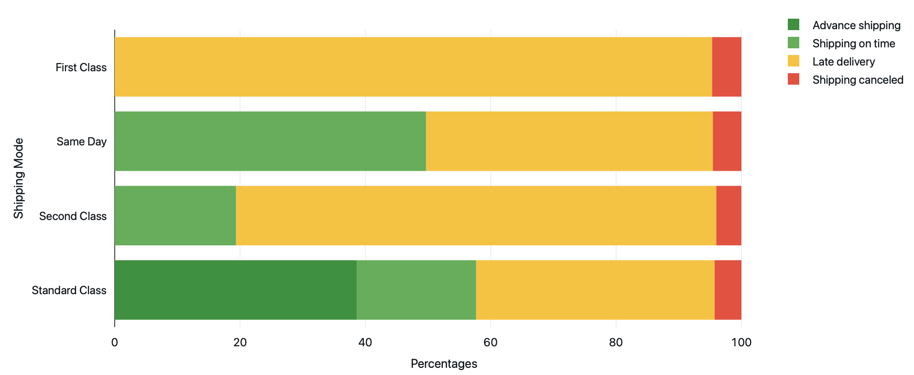
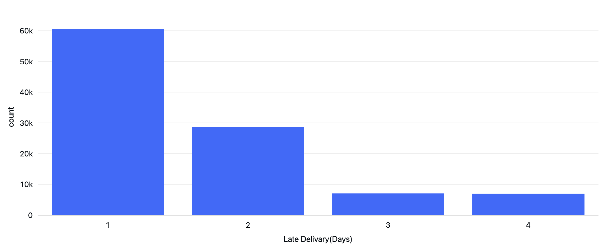
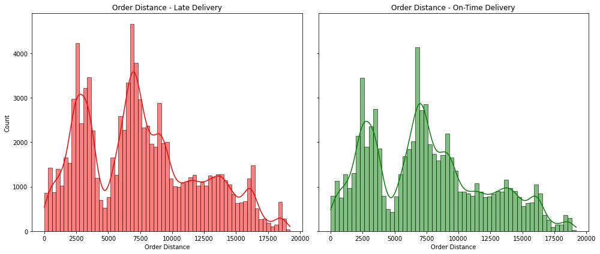

# DataCo Supply Chain - PySpark EDA Project on Databricks Environment

## Important Links
- **Databricks Notebook**: [Access Here](https://databricks-prod-cloudfront.cloud.databricks.com/public/4027ec902e239c93eaaa8714f173bcfc/649705917837865/179433283878260/8453874180793124/latest.html)
- **Dataset**: [Kaggle - DataCo Supply Chain](https://www.kaggle.com/datasets/shashwatwork/dataco-smart-supply-chain-for-big-data-analysis)

## Project Description
DataCo Global is a multinational company specializing in supply chain management, utilizing data-driven insights to optimize provisioning, production, sales, and distribution processes. In this project, we analyze a dataset from DataCo’s supply chain operations to evaluate performance across key metrics. The analysis was conducted using PySpark in Databricks, where we performed end-to-end data processing and visualization.

This project aims to identify key performance indicators (KPIs) and address essential business questions to improve operational efficiency, enhance customer satisfaction, and optimize financial performance through business analytics techniques.

## Dataset Description
The dataset consists of multiple CSV files:
- **Primary Dataset** (`DataCoSupplyChainDataset.csv`): Contains 53 columns and 180,519 records detailing various aspects of the supply chain, including order details, customer information, shipping, and financial data.
- **Column Description File** (`DescriptionDataCoSupplyChain.csv`): Provides detailed descriptions of each column in the primary dataset.
- **Access Logs** (`tokenized_access_logs.csv`): Contains 469,977 records across 8 columns, covering user access logs with fields such as IP address, visited URLs, and timestamps. These logs span from September 2017 to February 2018.
- **Order Cities Geolocation** (`order_city_geolocation.csv`): A supplementary dataset generated using `coordinate_generator.py`, which includes the geographic coordinates of various order cities. This data was utilized to calculate the distance between seller and buyer locations, enabling further analysis on delivery efficiency and logistics.

# Business Analysis Report

## 1. Operational Efficiency

### How does shipping mode affect delivery times and customer satisfaction? Which shipping modes are most reliable?

    
     
    <b>Figure 1.1:</b> Delivery Times by Shipping Mode

From **Figure 1.1**, we observe the following trends:
- **Same Day Delivery**: Although expected to deliver in 0 days, it consistently takes at least 1 day.
- **First Class Delivery**: Expected delivery in 1 day but consistently takes 2 days minimum.
- **Second Class Delivery**: Occasionally on schedule, but averages 4 days (twice the expected 2 days).
- **Standard Class**: The most reliable mode, with delivery times aligning closely to expectations.

    
     
    <b>Figure 1.2:</b> Delivery Status Distribution by Shipping Mode

In **Figure 1.2**:
- **Standard Time** and **Same Day Shipping**: Both deliver on time or early around 50% of the time.
- **Second Class**: Achieves on-time delivery for only 20% of orders.
- **First Class**: Records no on-time deliveries.
- Each mode experiences about 5% canceled shipments.

**Conclusion**: **First Class** shipping requires improvements in speed or reconsideration. Standard and Second Class also warrant optimizations to improve on-time rates.

---

### What is the average delay in delivery time, and how often do orders arrive late?

    
     
    <b>Figure 1.3:</b> Late Delivery Distribution

On average, orders are delayed by **1.62 days**, affecting **0.57%** of all shipments. **Figure 1.3** reveals that most late deliveries are delayed by only 1 day, but **40%** of delayed shipments take 2 or more days to arrive.

---

### What regions have the highest late delivery rates? What is the relationship to their distance?

    
     
    <b>Figure 1.4:</b> Order Distance Distribution by Delivery Status

Regions with the highest late delivery rates include **República Democrática del Congo** (62% of orders late), followed by:
- Nicaragua, Egipto, Austria, Alemania, India, El Salvador, Filipinas, Indonesia, and Francia, each with more than 58% of orders arriving late.

In **Figure 1.4**, we see that distance has minimal impact on delivery timeliness; the distribution of distances for late versus on-time deliveries is nearly identical.
